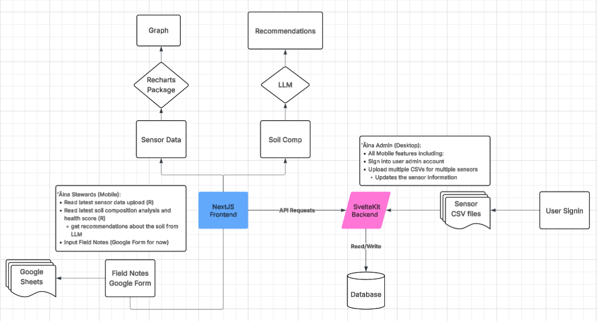

# Intern Onboarding for KILO Dashboard

### Current State of Frontend

- ✅ **Dashboard Home**: Baseline layout (header/sidebar)
- ✅ **Sensors**: Displays sensor graphs + last update
- ✅ **Kilo Page**: Embeds Google Form (Kilo i ka ʻāina)
- ✅ **Backend API Connection**: Connects to a separate [backend](https://kilo-backend.sandbox.purplemaia.org/) project that handles all database functions
- 🛠️ **To Build**:
    - Soil Composition Page
    - LLM Interaction Page (e.g. “Ask the ʻĀina”)
    - Mobile and offline-resilient UX tweaks

# Setup

- [ ]  install Node.js into computer & install `pnpm`
    - https://docs.npmjs.com/downloading-and-installing-node-js-and-npm
    - https://pnpm.io/installation
- [ ]  Clone and run `kilo-dashboard`
- [ ]  Checkout to `summer ` branch
- [ ]  Explore existing routes and layout components
- [ ]  Review `README.md` and any design system in place
- [ ]  run `pnpm install` to install all dependencies and `pnpm dev` to run a localhost development environment

## Architecture

# Challenges
## Frontend
### Mobile & Desktop Media Query Challenge

- [ ]  Create styling for a mobile and desktop version of the KILO dashboard
- [ ]  The desktop version should have the upload feature enabled but not on mobile 
    - [Tailwind CSS Media Query Design](https://tailwindcss.com/docs/responsive-design)
- NOTE: use chrome dev tools (Inspect or F12)

### Figma Redesign Challenge

- [ ]  Review current dashboard layout on desktop and mobile
- [ ]  Create a Figma redesign proposal for:
    - Home/dashboard
    - User Sign In form
    - Soil data page
- [ ]  Justify changes (typography, spacing, icons, card flow)
- [ ]  Try out some AI tools for UI help
    -  [Tools](https://medium.com/@xinranma/i-tested-4-ai-tools-to-generate-ui-from-the-same-prompt-0d2113736cce)
    -  [Magic Patterns](https://www.magicpatterns.com/)

---

## Backend (consult w/ Jaden to get set up)
### Soil Composition Page

**Goal**: Create a new frontend page using mock data

- [ ]  Create route `/soil`
- [ ]  Review current DB Schema
- [ ]  Grab soil composition data from test data (populate the temp-data file with csv)
- [ ]  Populate database based on schema with database migrations (Insert statements)
    - [golang-migrate](https://github.com/golang-migrate/migrate)
- [ ]  Style cards to be mobile-friendly
- [ ]  Include last updated timestamp and color indicators
- [ ]  Refer to [Makaliʻi Metrics portal](https://deploy-preview-2--mellow-zuccutto-57d56b.netlify.app/)

### LLM Application

- [ ]  Understand what the LLM will do in context to the soil page 
- [ ]  Create UI mockup for interaction: input, suggestions, loading state
- [ ]  Add placeholder page `/ask`
- [ ]  Figure out api handling within NextJS (sign in and csv uploads will occur only on Svelte API side)